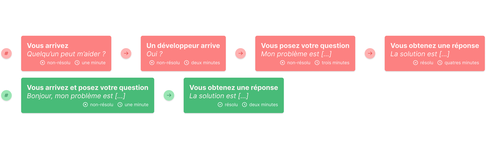

# [Main Menu](../README.md) / Methodology 

## General
- [:book: Todo-list](https://fr.wikipedia.org/wiki/Todo_list)
- [:wrench: Trello](https://trello.com/)
- [:book: Scrum](https://en.wikipedia.org/wiki/Scrum_(software_development))
- [:book: Kanban](https://en.wikipedia.org/wiki/Kanban)
- [:book: No Estimates](https://blog.cellenza.com/software-craftsmanship/estimer-sans-estimer/)

## Business
- [:book: Business Model Canvas](https://en.wikipedia.org/wiki/Business_Model_Canvas)

## Social Optimizations
- [:star: No Hello](https://www.nohello.com/)
- [:star: Don't ask to ask](https://dontasktoask.com)
- [:star: How to ask](https://stackoverflow.com/help/how-to-ask)
- [:star: The XY Problem](http://xyproblem.info/)

---

### Legend
:star: : Favorite\
:book: : Documentation/Cheatsheet\
:movie_camera: : Video\
:video_game: : Gamification\
:wrench: : Utility

---
